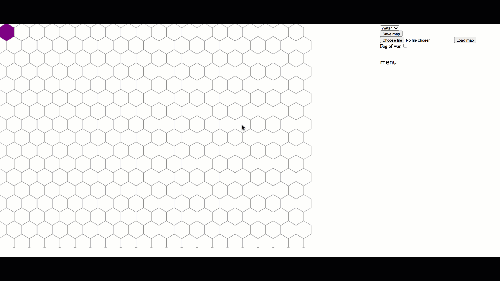

# Hex game - editor

This is an editor for Hex based game.

## Install & Run

```bash
npm install
npm start
```

## Features

This is an editor that allows you to do things such as

- **Save maps**, At any point, click `Save map` and it will be saved down. It will prompt you for a name, file ending `.json` will be added.
- **Load existing maps**, see [UK](UK.json) and [Stratego](stratego.json)
   - `Choose file` + `Load map` 
- **Paint**, select terrain from top right dropdown, click on the map
   - if it's white before the terrain is applied
   - if there is pre existing terrain it will be removed first, click again to apply terrain
- **Toggle fog of war**, there's checkbox that toggles *fog of war*

